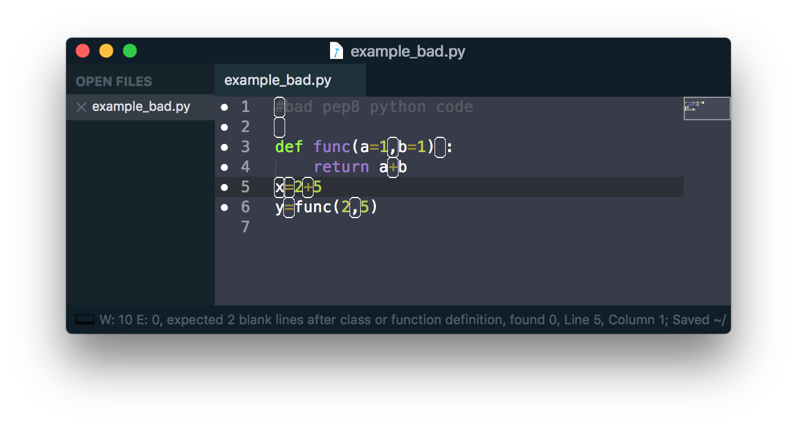
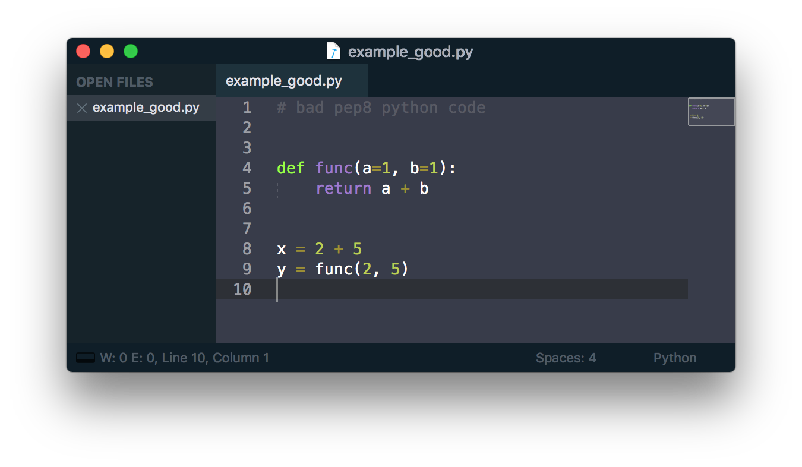

Developer: getting started
================================================
This section covers topics that have great documentation online. The main differences in this workflow stem from the hardware aspect of lightlab. That means almost all development should occur on the machine in lab that is going to be accessing the instruments. First, follow the instructions for connecting to the instrumentation server for users.

.. contents:: In this section
    :local:

Setting up Git
--------------
Your sysadmin should go on github and fork the repo into their or the lab's github account. Alternatively (not recommended), you can download the project and make a new repo on an internal Git server, like GitLab.

On the instrumentation server, go in and clone that repo. When you develop, it should be on a branch based off of the development branch. There is no need to clone the repo to your local computer.

File system sync
----------------
It is recommended that you use SSHFS to mirror your work to your local computer, so you can use your favorite text editor. While you are editing on your local machine, you should have a ssh session on the remote machine in order to run the commands.

1. Install SSHFS on your local system.

    - Linux: ``sudo apt-get install sshfs``
    - OSX: `Download binaries <https://osxfuse.github.io>`_ and then
        - Install FUSE for macOS
        - Install SSHFS for macOS

2. Make shortcuts in your ``.bashrc`` or ``.bash_profile``

Linux::

    alias mntlight='sshfs <server>:/home/hermione/Documents /path/to/local/dir -C -o allow_other'
    alias umntlight='fusermount -u /path/to/local/dir'

MacOS::

    alias mntlight='sshfs <server>:/home/hermione/Documents /path/to/local/dir -C -o allow_other,auto_cache,reconnect,defer_permissions,noappledouble'
    alias umntlight='umount /path/to/local/dir'

4. Now you can mount and unmount your remote calibration-instrumentation folder with::

    $ mntlight
    $ unmtlight

Example directory structure, environment, and usage
---------------------------------------------------
If you are developing lightlab, you will likely have some other notebooks to test. Those should go in a different directory with a different virtual environment. It can be git tracked in a different repo. Here is an example directory structure::

    > hermione/Documents
    | > lightlab
    | | > .git
    | | Makefile
    | | setup.py
    | | etc...
    | -
    | > myWork
    | | Makefile
    | | requirements.txt
    | | .pathtolightlab
    | | > notebooks
    | | | gatherData.ipynb
    | | -
    | | > data
    | | | someData.pkl
    | | -
    | -
    -

Where the Makefile has targets for making a virtual environment and launching jupyter

.. code-block:: bash
    :emphasize-lines: 9

    # myStuff/Makefile
    PATH2LIGHTLABFILE=.pathtolightlab

    venv: venv/bin/activate
    venv/bin/activate: requirements.txt
        test -d venv || virtualenv -p python3 --prompt "(myWork-venv) " --distribute venv
        venv/bin/pip install -Ur requirements.txt
        touch venv/bin/activate
        source venv/bin/activate; venv/bin/pip install -e $(shell cat $(PATH2LIGHTLABFILE))

    jupyter: devbuild
        source venv/bin/activate; jupyter notebook; \

    getjpass: venv
        venv/bin/python -c 'from notebook.auth import passwd; print(passwd())'

The highlighted line will dynamically link the environment to your version of lightlab under development. If you have autoreload on in ipython, then text changes in lightlab will take effect immediately (excluding adding new methods).

The contents of ``.pathtolightlab`` are::

    /home/hermione/Documents/lightlab

If this is a repo, your ``.gitignore`` should include::

    .pathtolightlab

Running jupyter from your ``myWork`` environment
^^^^^^^^^^^^^^^^^^^^^^^^^^^^^^^^^^^^^^^^^^^^^^^^
Password protect
****************
Jupyter lets you run commands on your machine from a web browser. That is dangerous because anybody with an iphone can obliviate your computer with ``rm -rf /``, and they can obliviate your research with ``currentSource(applyAmps=1e6)``. Be safe on this one.

On the lab computer, copy and modify the provided template::

    $ mkdir ~/.jupyter
    $ cp /home/jupyter/.jupyter/jupyter_notebook_config.py ~/.jupyter

then generate a password with::

    $ make getjpass
    Enter password: <Enters password>
    Verify password: <Enters password>

This will produce one line containing a hash of that password of the form::

    sha1:b61b...frq

Choose an unused port. Port allocations on your lab computer should be discussed with your group. Let's say you got :8885.

When you have a port and a password hash, update the config file::

    $ nano ~/.jupyter/jupyter_notebook_config.py

.. code-block:: python

    ...
    ## Hashed password to use for web authentication.
    c.NotebookApp.password = 'sha1:b61b...frq' # hash from above
    ...
    ## The port the notebook server will listen on.
    c.NotebookApp.port = 8885 # port from above

Launch the server
*****************
To launch the server from ``myWork``, just run::

    $ make jupyter

(see Makefile target above). Except that will lock up your shell session. Instead, you can spin off a process to serve jupyter in a tmux::

    $ tmux new -s myNotebookServer
    $ make jupyter
    <Ctrl-b, d>  # to detach

You can now acces your notebooks anywhere with your password at: ``https://<server name>.school.edu:<port>``.

If for some reason you want to reconnect to this process, you can use ``tmux attach-process -t myNotebookServer`` or ``tmux ls`` followed by picking the right name. If you really want to kill it, you can::

    $ ps aux | grep <username> | grep myNotebookServer

Find the PID, and send a ``kill -9`` at it.

Git and jupyter
***************
They do not play nice. Here are some :doc:`strategies </_static/misc/mergeWithNotebooks>` for not losing too much work.

Running monitor server from your ``myWork`` environment
^^^^^^^^^^^^^^^^^^^^^^^^^^^^^^^^^^^^^^^^^^^^^^^^^^^^^^^
``lightlab`` offers tools for monitoring progress of long sweeps. See :py:class:`~lightlab.util.io.ProgressWriter`. These servers are launched from your own environment, not lightlab's. So far, this is just for long sweeps that simply tell you how far along they are, and when they will complete.

First, you must get another port allocated to you, different from the one you used for Jupyter. Put that in a file called ``.monitorhostport`` in ``myWork`` (where the Makefile is). Let's say that port is 8000::

    $ echo 8000 > .monitorhostport
    $ mkdir progress-monitor

Add the following target to your ``Makefile``::

    monitorhost:
        ( \
            source venv/bin/activate; \
            cd progress-monitor; \
            python3 -m http.server $(shell cat .monitorhostport); \
        )

If this is a repo, add the following to ``.gitignore``::

    .monitorhostport
    progress-monitor/*

To then launch the server from a tmux::

    $ tmux new -s myMonitorServer
    $ make monitorhost
    <Ctrl-b, d>  # to detach

.. note::

    I have tried making a daemon launch automatically from the lightlab.util.io library. I have not yet verified that it is safe, so it is currently disabled.

.. todo::

    How will this work for non-developers?

Testing
^^^^^^^
It's not really necessary in this example where there is just a notebook. If you are developing your own library-like functions, it is generally good practice, but

**Never put hardware accessing methods in a unittest**

Unittests are designed to be run in an automated way in a repeatable setting. Firstly, the real world is not repeatable. Secondly, an automated run could do something unintended and damaging to the currently connected devices.

Contributing to ``lightlab``
------------------------------
We follow this `Git branching workflow <http://nvie.com/posts/a-successful-git-branching-model/>`_. Feature branches should base off of development; when they are done, they must pass tests and test-nb's; finally they are merged to development.

Testing
^^^^^^^
First off, your change should not break existing code. You can run automated tests like this::

    make test
    make test-nb

The test-nb target runs the **notebooks** in notebooks/Tests. This is a cool feature because it allows you to go in with jupyter and see what's happening if it fails.

**Make tests for your features!** It helps a lot. Again, **Never put hardware accessing methods in a unittest**. We recommend using the `nbval <https://github.com/computationalmodelling/nbval>`_ approach. It checks for no-exceptions, not accuracy of results. If you want to check for accuracy of results, do something like::

    x = 1 + 1
    assert x == 2

in the cell.

To run just one test, use a command like::

    $ source venv/bin/activate
    $ py.test --nbval-lax notebooks/Tests/TestBook.ipynb

Documenting
^^^^^^^^^^^^^^
Documenting as you go is helpful for other developers and code reviewers.  So useful that we made a whole :doc:`tutorial <docYourCode>` on it. We use auto-API so that docstrings in code make it into the official documentation.

Linting
^^^^^^^
As of now, we don't require strict `PEP-8 <https://www.python.org/dev/peps/pep-0008/>`_ compliance, but we might in the future. However, we try to follow as many of their guidelines as possible. If you use Sublime, `here <https://github.com/SublimeLinter/SublimeLinter-flake8>`_ is a good linter. It visually shows what is going on while you code, saving lots of headaches:

    Example of valid python code that violates some of the PEP8 guidelines.

    Fixing the PEP8 violations of the previous figure.

Sometimes the linter is wrong. You can tell it to ignore lines by adding comment flags like the following example:

.. code:: python

    x = [x for x in sketchy_iterable]  # pylint: disable=not-an-iterable
    from badPractice import *  # noqa

``# noqa`` is going to ignore pyflakes linting, whereas ``# pylint`` configures `pylint` behavior.

Adding a new package
^^^^^^^^^^^^^^^^^^^^^
Two ways to do this. The preferred method is to add it to the package requirements in ``setup.py``. The other way is in the venv. In that case, make sure you freeze the new package to the requirements file::

    $ source venv/bin/activate
    $ pip install <package>
    $ make pip-freeze
    $ git commit -m "added package <package> to venv"

.. warning::

    If your code imports an external package, the sphinx documentation will try to load it and fail. The solution is to mock it. Lets say your source file wants to import::

        import scipy.optimize as opt

    For this to pass and build the docs, you have to go into the ``docs/sphinx/conf.py`` file. Then add that package to the list of mocks like so::

        MOCK_MODULES = [<other stuff>, 'scipy.optimize']

* :ref:`genindex`
* :ref:`modindex`
* :ref:`search`
