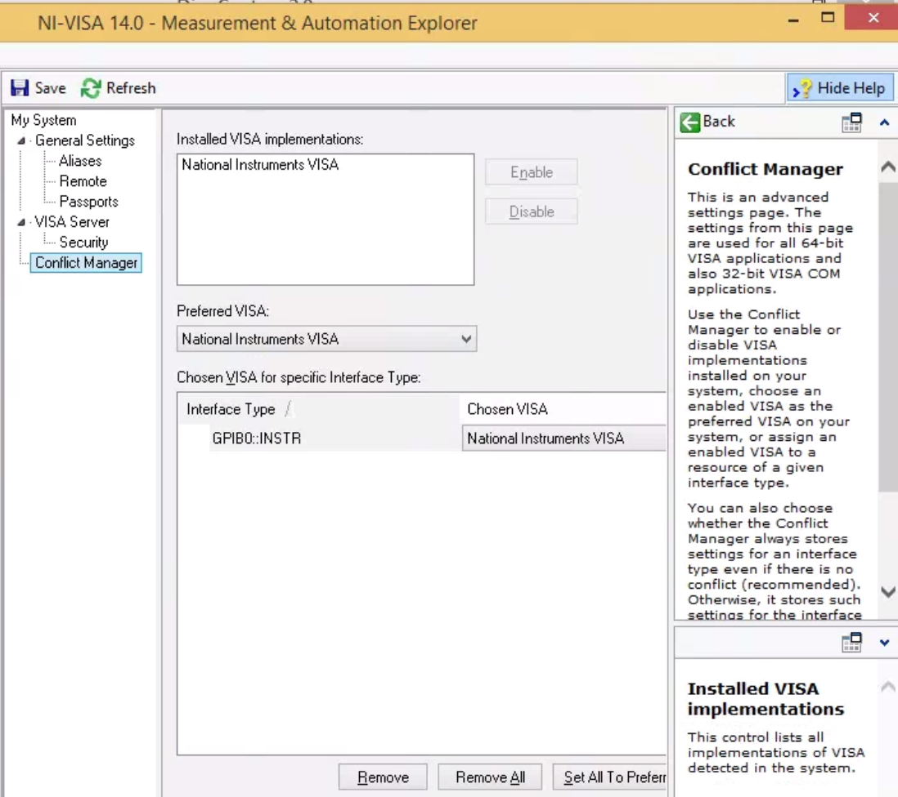

Sysadmin: getting started
================================================
The basic setup is that there is one central lab computer that is the "instrumentation server." Other computers connect to the instruments through GPIB/USB/etc. These are "hosts." All of the hosts need National Instruments (NI) Measurement and Automation eXplorer (MAX).

Host machines
^^^^^^^^^^^^^

Installing NI-visa (32-bit) in Ubuntu (64-bit)
----------------------------------------------
Followed instructions `found here <http://forums.ni.com/t5/Linux-Users/Using-NI-VISA-with-Arch-Linux-or-Ubuntu-14-04/gpm-p/3462361#M2287>`_, but in computers with EFI secure boot, like all modern ones, we need to sign the kernel modules for and add the certificate to the EFI. For this, follow these `instructions <http://askubuntu.com/questions/762254/why-do-i-get-required-key-not-available-when-install-3rd-party-kernel-modules>`_.

Sign all modules in ``/lib/modules/newest_kernel/kernel/natinst/*/*/.ko``

Run the following after sudo updateNIdrivers (reboot required!)::

    kofiles=$(find /lib/modules/$(uname -r)/kernel/natinst | grep .ko)
    for kofile in $kofiles; do
        sudo /usr/src/linux-headers-$(uname -r)/scripts/sign-file sha256 /home/tlima/MOK.priv /home/tlima/MOK.der $kofile
    done

Then start nipalk::

    sudo modprobe nipalk
    sudo /etc/init.d/nipal start

Opening NI-visa servers on all hosts
------------------------------------
Open NI-MAX. In the main menu bar: Tools > NI-VISA > VISA options. This will open a panel.

In My System > VISA Server, check "Run the VISA server on startup." Click "Run Server Now."

.. figure:: images/nimax-server.png
    :alt: Server step
    :figwidth: 400px
    :align: center

In My System > VISA Server > Security, click the Add button, and put in a "*" under Remote Addresses. This white flags all other computers.

.. figure:: images/nimax-security.png
    :alt: Security step
    :figwidth: 400px
    :align: center

Click Save at the top left.

Troubleshooting
***************
If you have been using Tektronix drivers, there might be a conflict with which VISA implementation will get used. These can be managed in the Conflict Manager tab.

General settings > Passports: Tulip sometimes gives trouble. The box should be checked, at least on 32-bit systems. Bugs were un-reproducible for us.

Instrumentation server machine
^^^^^^^^^^^^^^^^^^^^^^^^^^^^^^
*The below assumes that this system is Linux.*

User configuration
------------------------------------
There are several types of users.

    * sysadmin (you)
    * super-users a.k.a. root (you, possibly other lab members who know UNIX)
    * ``lightlab`` developers
    * ``lightlab`` users
    * those with lab access, meaning they are allowed to configure and access hardware (you, most grad students)
    * those without lab access, meaning they can still see data and write data analysis code (most undergrads)

In the below examples, we will use the following usernames

    * arthur:    you, sysadmin
    * lancelot:  a grad student and ``lightlab`` developer
    * bedivere:  a grad student user
    * galahad:   an undergrad who is anayzing bedivere's data

Set up a user on this computer corresponding to every user who will be using the lab. Make sure port 22 is open for ssh access. Give them all a tutorial on ssh, python, and ipython. Give yourself and lancelot a tutorial on git, SSHFS, pip, and jupyter.

Install basic tools globally
----------------------------
``lightlab`` requires python 3.6. You also will need to use virtual environments to execute compiled code, install and freeze dependencies, and launch IPython servers. The first time, install these on your system environment::

    $ sudo apt-get update
    $ sudo apt-get install python3.6

    $ sudo apt-get install python-pip python-dev build-essential
    $ sudo pip install --upgrade pip
    $ sudo pip install --upgrade virtualenv

For different versions of Ubuntu/Linux, you are on your own. See `here <https://www.saltycrane.com/blog/2010/02/how-install-pip-ubuntu/>`_ and `there <https://askubuntu.com/questions/865554/how-do-i-install-python-3-6-using-apt-get>`_.

Manage port security (optional)
-------------------------------
It is possible to restrict port usage by process type. This is a security measure. For example, ports 8820-8830 can be opened, but only for processes named "jupyter".

@hpeng: how do you do these?

We recommend setting up a certificate file and using https. Instructions are here (@hpeng, please link it)

Jupyter notebooks can run arbitrary system commands. Since jupyter does not yet support key authentication, the only protection is strong passwords. There should *never* be a jupyter server launched by root.

Initializing labstate, setting lab accessors
---------------------------------------------------
Make a jupyter "user"::

    sudo useradd -m jupyter
    sudo passwd jupyter
    <enter a new password twice>

Make a jupyter group specifying who is allowed to run jupyter servers and change the labstate::

    sudo groupadd jupyter
    sudo usermod -a -G jupyter arthur
    sudo usermod -a -G jupyter lancelot
    sudo usermod -a -G jupyter bedivere
    <do not add galahad>

The jupyter user home directory can be accessed by any user and written only by the jupyter users::

    cd /home
    sudo chown root jupyter
    sudo chgrp jupyter jupyter
    sudo chmod a+r jupyter
    sudo chmod a+x jupyter
    sudo chmod g+w jupyter

The labstate will be automatically put and backed up in the directory ``/home/jupyter/labstate.json``. If anybody outside of group jupyter tries to change the labstate, it will not work.

@tlima please check
@tlima, maybe instead of group jupyter, we should call it something like "labaccess"

The first time labstate is initialized, you'll want to add the hosts and benches in the lab. This is documented in :doc:`/_static/developers/labState`.

Running a jupyter server for the regular users
----------------------------------------------
Developers can run their own servers, but there are two reasons to have a centralized one like this. 1) keeps data and notebooks centralized so they can be shared and git-tracked easily, 2) serves users who are not developers and who therefore do not need an environment that links dynamically to lightlab.

Create a directory for your lab's data gathering notebooks and data. Ours is called lightdata::

    cd /home/jupyter
    mkdir lightdata
    chgrp lightdata jupyter
    chmod a+r lightdata
    chmod a+x lightdata
    chmod g+w lightdata
    chmod +t lightdata

The last line sets the sticky bit. That means when a file is created within that directory, it can only be modified or deleted by its owner (i.e. the person that created it).

@tlima: how do you set the port and password? Where do you launch the notebook?

Handling virtual environments that install lightlab
---------------------------------------------------
@tlima I am shaky on this section

Install `virtualenvwrapper <http://virtualenvwrapper.readthedocs.io/en/latest/index.html>`_ with pip.

Put this in all users' ``.bashrc``::

    # Working with multiple virtualenv's
    export WORKON_HOME=/home/jupyter/Envs
    source /usr/local/bin/virtualenvwrapper.sh

They can then call ``workon development`` and ``workon master``.

If you have developers, set up CI for your own fork (optional)
------------------------------------------------------------------
@tlima I am shaky on this section

* :ref:`genindex`
* :ref:`modindex`
* :ref:`search`
