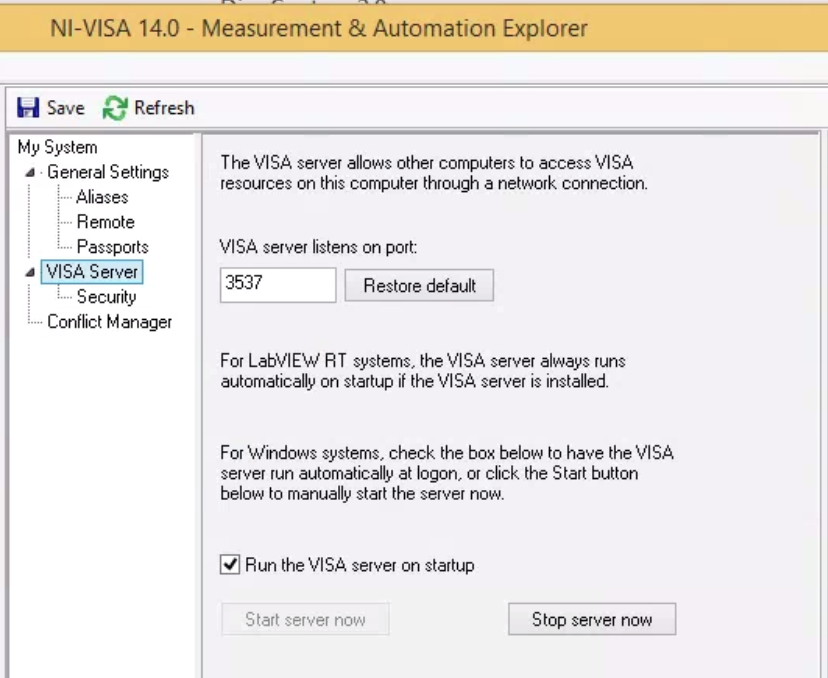
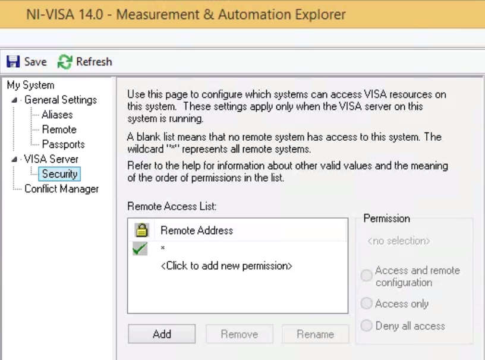

.. _centralized_server:

Centrallized server (Tutorial)
------------------------------

.. highlight:: bash

The instructions below allow you to control multiple instruments connected to a network of hosts from a single location.

The basic setup is that there is one central lab computer that is the "instrumentation server." Other computers connect to the instruments through GPIB/USB/etc. These are "hosts." All of the hosts need National Instruments (NI) Measurement and Automation eXplorer (MAX). Start a `NI Visa Server` in each host, and naturally connect from the server via pyvisa.

Host machines
^^^^^^^^^^^^^

You first need to install NI-VISA in all machines, including the server, which can also play the dual role of a host, since it can also be connected to instruments. Download NI-VISA `here <http://www.ni.com/visa/>`_. Installing for MacOS, Windows, Linux (Fedora-like) was a matter of following NI's instructions. Installing in ubuntu machines was a little trickier, but here is what worked for us.

.. _ubuntu_installation:

Installing NI-visa (32-bit) in Ubuntu (64-bit)
""""""""""""""""""""""""""""""""""""""""""""""

Followed instructions `found here <http://forums.ni.com/t5/Linux-Users/Using-NI-VISA-with-Arch-Linux-or-Ubuntu-14-04/gpm-p/3462361#M2287>`_, but in computers with EFI secure boot, like all modern ones, we need to sign the kernel modules for and add the certificate to the EFI. For this, follow these `instructions <http://askubuntu.com/questions/762254/why-do-i-get-required-key-not-available-when-install-3rd-party-kernel-modules>`_.

Sign all modules in ``/lib/modules/newest_kernel/kernel/natinst/*/*/.ko``

Run the following after sudo updateNIdrivers (reboot required!)::

    kofiles=$(find /lib/modules/$(uname -r)/kernel/natinst | grep .ko)
    for kofile in $kofiles; do
        sudo /usr/src/linux-headers-$(uname -r)/scripts/sign-file sha256 /home/tlima/MOK.priv /home/tlima/MOK.der $kofile
    done

Then start nipalk::

    sudo modprobe nipalk
    sudo /etc/init.d/nipal start

Test with::

    visaconf  # for configuring, for example, GPIB interfaces
    NIvisaic  # for testing instrument control

Opening NI-visa servers on all hosts
""""""""""""""""""""""""""""""""""""
Open NI-MAX. In the main menu bar: Tools > NI-VISA > VISA options. This will open a panel.

In My System > VISA Server, check "Run the VISA server on startup." Click "Run Server Now."

In My System > VISA Server > Security, click the Add button, and put in a "*" under Remote Addresses. This white flags all other computers.

Click Save at the top left.

Troubleshooting
***************
If you have been using Tektronix drivers, there might be a conflict with which VISA implementation will get used. These can be managed in the Conflict Manager tab.

.. figure:: images/nimax-conflict.png
    :alt: Conflict step
    :figwidth: 400px
    :align: center

General settings > Passports: Tulip sometimes gives trouble. The box should be checked, at least on 32-bit systems. Bugs were un-reproducible for us.

Instrumentation server machine
^^^^^^^^^^^^^^^^^^^^^^^^^^^^^^
*The below assumes that this system is Linux.*

User configuration
""""""""""""""""""
There are several types of users.

    * sysadmin (you)
    * super-users a.k.a. root (you, possibly other lab members who know UNIX)
    * ``lightlab`` developers
    * ``lightlab`` users
    * those with lab access, meaning they are allowed to configure and access hardware (you, most grad students)
    * those without lab access, meaning they can still see data and write data analysis code (most undergrads)

In the below examples, we will use the following usernames

    * arthur:    you, sysadmin
    * lancelot:  a grad student and ``lightlab`` developer
    * bedivere:  a grad student user
    * galahad:   an undergrad who is anayzing bedivere's data

Set up a user on this computer corresponding to every user who will be using the lab. Make sure port 22 is open for ssh access. Give them all a tutorial on ssh, python, and ipython. Give yourself and lancelot a tutorial on git, SSHFS, pip, and jupyter.

Install basic tools globally
""""""""""""""""""""""""""""
``lightlab`` requires python 3.6. You also will need to use virtual environments to execute compiled code, install and freeze dependencies, and launch IPython servers. The first time, install these on your system environment:

.. code-block:: bash

    $ sudo apt-get update
    $ sudo apt-get install python3.6

    $ sudo apt-get install python-pip python-dev build-essential
    $ sudo pip install --upgrade pip
    $ sudo pip install --upgrade virtualenv

For different versions of Ubuntu/Linux, you are on your own. See `here <https://www.saltycrane.com/blog/2010/02/how-install-pip-ubuntu/>`_ and `there <https://askubuntu.com/questions/865554/how-do-i-install-python-3-6-using-apt-get>`_.

Initializing labstate, setting lab accessors
"""""""""""""""""""""""""""""""""""""""""""""""

Make a *jupyter* "user":

.. code-block:: bash

    sudo useradd -m jupyter
    sudo passwd jupyter
    <enter a new password twice>

Make a *jupyter* group specifying who is allowed to run jupyter servers and change the labstate:

.. code-block:: bash

    sudo groupadd jupyter
    sudo usermod -a -G jupyter arthur
    sudo usermod -a -G jupyter lancelot
    sudo usermod -a -G jupyter bedivere
    # <do not add galahad>

The *jupyter* user home directory can be accessed by any user and written only by the *jupyter* users:

.. code-block:: bash

    cd /home
    sudo chown root jupyter
    sudo chgrp jupyter jupyter
    sudo chmod a+r jupyter
    sudo chmod a+x jupyter
    sudo chmod g+w jupyter

We want to place ``labstate.json`` in ``/home/jupyter/labstate.json``. As documented :ref:`above <advanced_installation>`, this can be done system-wide with::
    
    # Running from an environment in which lightlab is installed
    sudo lightlab config --system set labstate.filepath /home/jupyter/labstate.json

If anybody outside of group *jupyter* tries to change the labstate, it will not work.

The first time labstate is initialized, you'll want to add the hosts and benches in the lab. This is documented in :doc:`/_static/developers/labState`.

Handling virtual environments that install lightlab
"""""""""""""""""""""""""""""""""""""""""""""""""""

Install `virtualenvwrapper <http://virtualenvwrapper.readthedocs.io/en/latest/index.html>`_ with pip.

To make all users see the same virtualenvwrapper, create a file in ``/etc/profile.d/virtualenvwrapper.sh`` and place the following bash script:

.. code-block:: bash

    # Working with multiple virtualenv's
    export WORKON_HOME=/home/jupyter/Envs
    source /usr/local/bin/virtualenvwrapper.sh

.. note::

    Make sure that ``/home/jupyter/Envs`` belongs to the group *jupyter* and that permissions are set so that users necessary can have access to it.

Then, follow the instructions (adapted from ``virtualenvwrapper.sh``'s source code):

.. code-block:: bash

    #  1. Create a directory to hold the virtual environments.
    #     (mkdir /home/jupyter/Envs).
    #  5. Run: workon
    #  6. A list of environments, empty, is printed.
    #  7. Run: mkvirtualenv lightlab
    #  8. Run: workon
    #  9. This time, the "lightlab" environment is included.
    # 10. Run: workon lightlab
    # 11. The virtual environment lightlab is activated.

Then, every user in the machine can call ``workon lightlab`` to activate lightlab's virtualenvironment.

Running a jupyter server for the regular users
""""""""""""""""""""""""""""""""""""""""""""""

.. important:: **Securing a jupyter notebook server.**

    Please follow instructions in `Securing a notebook server <http://jupyter-notebook.readthedocs.io/en/stable/public_server.html#securing-a-notebook-server>`_ if you and more user plan to connect to the server remotely.

    Jupyter notebooks can run arbitrary system commands. Since jupyter does not yet support key authentication, the only protection is strong passwords. There should *never* be a jupyter server launched by root.

Developers can run their own virtual environments, but there are two reasons to have a centralized one like this. 1) keeps data and notebooks centralized so they can be shared to outsiders and git-tracked easily, 2) serves users who are not developers and who therefore do not need an environment that links dynamically to lightlab.

Create a directory for your lab's data gathering notebooks and data. Ours is called lightdata:

.. code-block:: bash

    cd /home/jupyter
    mkdir lightdata
    chgrp lightdata jupyter
    chmod a+r lightdata
    chmod a+x lightdata
    chmod g+w lightdata
    chmod +t lightdata

The last line sets the sticky bit. That means when a file is created within that directory, it can only be modified or deleted by its owner (i.e. the person that created it).

Finally, after having adapted security instructions above, you should have an SSL certificate and port configuration setup in ``/home/username/.jupyter/jupyter_notebook_config.py``, start your jupyter server from within the virtual environment by doing the following:

.. code-block:: bash

    # logged in as any user in jupyter group
    cd /home/jupyter/lightdata
    workon lightlab

    # in case you have just created this virtual environment
    pip install lightlab

    # and other packages you find useful. See our full list 
    # in dev-requirements.txt in our github page.
    pip install jupyter pyusb pyserial

    # set a password for your notebook. This will be stored 
    # in /home/username/.jupyter/jupyter_notebook_config.json
    jupyter notebook password  

    # starts the jupyter notebook process and stays alive 
    # until stopped with Ctrl-C
    jupyter notebook

If you have developers, set up CI for your own fork (optional)
""""""""""""""""""""""""""""""""""""""""""""""""""""""""""""""""""

If you are constantly helping with the development of lightlab, it is possible to utilize CI (continuous integration) to automate reinstallation of the package. In our case, we use `Gitlab CI/CD <https://about.gitlab.com/features/gitlab-ci-cd/>`_ in a different machine to trigger the deploy in the instrumentation server.

User: getting started
^^^^^^^^^^^^^^^^^^^^^

These are instructions that you may give to potential users in this setup. We recommend you placing the source code of lightlab inside ``/home/jupyter/lightdata/lightlab`` for their convenience. The source code has tutorial notebooks in ``lightlab/notebooks``. We also recommend placing this documentation in ``docs``, which can be modified by you, to make it easier. Jupyter servers can render ``.md`` files and can also serve ``html`` pages such as this one.

Connecting to the instrumentation server
""""""""""""""""""""""""""""""""""""""""
First, make sure that your have a user account set up on the your server. Let's say your domain is "school.edu" First, do a manual log on to change your password to a good password. From your local machine::

    $ ssh -p 22 <remote username>@<server hostname>.school.edu
    <Enter old password>
    $ passwd
    <Enter old, default password, then the new one>

Make an RSA key
"""""""""""""""
On your local machine::

    ssh-keygen -t rsa -C "your.email@school.edu" -b 4096

You do not have to make a password on your ssh key twice, so press enter twice. Then copy that key to the server with::

    $ ssh-copy-id <remote username>@<server hostname>.school.edu
    <Enter new password>

Faster logging on
"""""""""""""""""
In your local machine, add the following lines to the file ``~/.ssh/config``::

    Host <short name>
         HostName <server name>.school.edu
         User <remote username>
         Port 22
         IdentityFile ~/.ssh/id_rsa

You can now ``ssh <short name>``, but it is recommended that you use `MOSH <https://mosh.org/>`_ to connect to the server::

    $ mosh <short name>

MOSH is great for spotty connections, or if you want to close your computer and reopen the ssh session automatically.

Using jupyter notebooks
"""""""""""""""""""""""
Jupyter notebooks are interactive python sessions that run in a web browser. If you are just a user, your sysadmin will set up a notebook server and give you a URL and password. Some examples can be found in the ``lightlab/notebooks/Tests`` directory.

