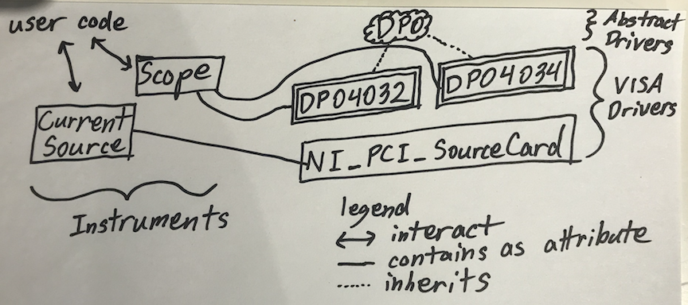
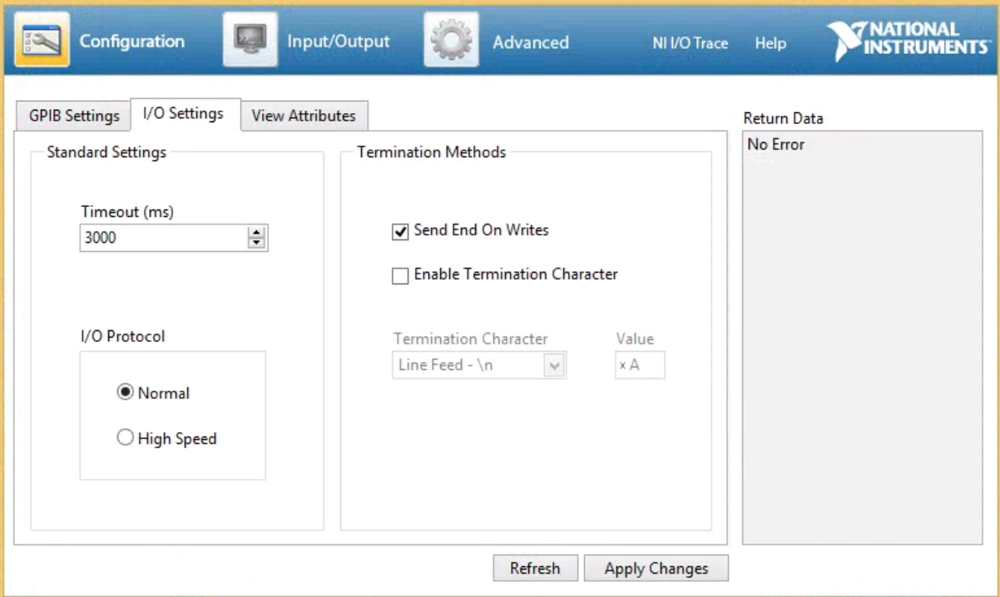

.. _creating_drivers:

Drivers
====================================================

.. contents:: In this section
    :local:

Drivers are the original impetus for sharing this project. Writing drivers can be fun (the first few times). It exercises the full range of electrical engineering knowledge. It can be a snap, or it can take multiple PhD students several days to realize which cable needed a jiggle. The reward is automated, remote lab control!

The instrument abstraction
--------------------------
In ``lightlab``, there are two layers of abstraction for instrumentation

.. currentmodule:: lightlab.laboratory.instruments

1. :py:class:`~Instrument`, such as
    * :py:class:`~Oscilloscope`
    * :py:class:`~Keithley`

.. currentmodule:: lightlab.equipment.lab_instruments.visa_drivers

2. :py:class:`~lightlab.equipment.lab_instruments.VISAInstrumentDriver`, such as
    * :py:class:`~Tektronix_DPO4032_Oscope`
    * :py:class:`~Tektronix_DPO4034_Oscope`
    * :py:class:`~Keithley_2400_SM`

An :py:class:`~lightlab.laboratory.instruments.Instrument` refers to a category of instruments that do certain things. A :py:class:`~lightlab.equipment.lab_instruments.VISAInstrumentDriver` describes how a particular piece of equipment does it. As a rule of thumb, there is a different driver for each model of instrument.

All oscilloscopes have some form of acquiring a waveform, and user code makes use of that abstraction. If you have a scope other than a TEKTRONIX DPO4032, you are on your own with the driver. BUT, if you can make your low-level driver for that scope to meet the abstraction of :py:class:`~Oscilloscope`, then your scope will be equivalent to my scope, in some sense. That means all of the rest of the package becomes usable with that scope.

The critical part of an Instrument child class are its ``essentialMethods`` and ``essentialProperties``. Initialization and book keeping are all done by the super class, and implementation is done by the driver. The driver must implement all of the essential methods and properties, and then the :py:class:`~Instrument` will take on these data members as its own.

As in the case of Tektronix_DPO4032_Oscope and Tektronix_DPO4034_Oscope, there is substantial overlap in implementation. We can save a lot of work by abstracting some of the common behavior, which leads to the third major concept of abstract drivers, found in the module:

.. currentmodule:: lightlab.equipment.abstract_drivers

3. :py:mod:`~lightlab.equipment.abstract_drivers`, which includes
    * :py:class:`~DPO_Oscope`
    * :py:class:`~MultiModalSource`

Before writing a fresh driver, check out the abstract ones to see if you can partially use existing functionality (e.g. if you are making one for a DPO4038).

    Three concepts for ``lightlab`` instrumentation. 1) Instruments, 2) VISAInstrumentDrivers, 3) Abstract drivers.

Writing a :py:class:`~lightlab.equipment.lab_instruments.VISAInstrumentDriver`
-------------------------------------------------------------------------------
For new developers, you will likely have instruments not yet contained in ``lightlab``. We encourage you to write them, test them, and then create a pull request so that others won't have to re-invent the wheel.

Basics
------
A communication session with a message-based resource has the following commands

    * open
    * close
    * write
    * read
    * query (a combination of write, then read)

The `PyVISA <http://pyvisa.readthedocs.io/en/stable/>`_ package provides the low level communication. Drivers can be GPIB, USB, serial, or TCP/IP -- the main difference is in the address. PyVISA also has a resource manager for initially finding the instrument. ``lightlab`` has a wrapper for this that works with multiple remote Hosts. See :doc:`/_static/developers/labState` for putting a Host in the labstate.

Plug your new instrument (let's say GPIB, address 23) into host "alice", then, in an ipython session

.. code-block:: python
    :emphasize-lines: 10

    > from lightlab.laboratory.state import lab
    > for resource in lab.hosts['alice'].list_resources_info():
    ...   print(resource)
    visa://alice.school.edu/USB0::0x0699::0x0401::B010238::INSTR
    visa://alice.school.edu/TCPIP0::128.112.48.124::inst0::INSTR
    visa://alice.school.edu/ASRL1::INSTR
    visa://alice.school.edu/ASRL3::INSTR
    visa://alice.school.edu/ASRL10::INSTR
    visa://alice.school.edu/GPIB0::18::INSTR
    visa://alice.school.edu/GPIB0::23::INSTR

That means the instrument is visible, and we know the full address::

    > from lightlab.equipment.lab_instruments.visa_connection import VISAObject
    > newInst = VISAObject('visa://alice.school.edu/GPIB0::23::INSTR')
    > print(newInst.instrID())
    KEITHLEY INSTRUMENTS INC.,MODEL 2400, ...

That means the instrument is responsive, and basic communication settings are correct already. Time to start writing.

Troubleshooting 1: Write termination
*********************************************
Try this::

    > newInst.open()
    > newInst.mbSession.write_termination = ''
    > newInst.mbSession.clear()
    > print(newInst.instrID())

and play around with different line terminations. There are also different options for handshaking to be aware of, as well as baud rate attributes. For debugging at this level, we recommend the NI visaic.

    NI Visa Interactive Control window. Change around line settings, then write "\*IDN?" in the Input/Output. See attributes for more advanced settings.

When you find something that works, overload the ``open`` method. Do not try to set these things in the ``__init__`` method.

Troubleshooting 2: No "\*IDN?" behavior
*********************************************
Some instruments don't even though it is a nearly universal requirement. In that case, find some simple command in the manual to serve as your "is this instrument alive?" command. Later, overload the ``instrID`` method.

Configurable
-------------
Many instruments have complex settings and configurations. These are usually accessed in a message-based way with ``write(':A:PARAM 10')`` and ``query(':A:PARAM?')``. We want to create a consistency between driver and hardware, but

1. we don't care about the entire configuration all the time, and

2. it doesn't make sense to send configuration commands all the time.

:py:class:`~lightlab.equipment.lab_instruments.configure.configurable.Configurable` builds up a minimal notion of consistent state and updates hardware only when it might have become inconsistent. The above is done with ``setConfigParam('A:PARAM', 10)`` and ``getConfigParam('A:PARAM')``. If you set the parameter and then get it, the driver will not communicate with the instrument -- it will look up the value you just set. Similarly, it will avoid setting the same value twice. For example,::

    # Very slow
    def acquire(self, chan):
        self.write(':CH ' + str(chan))
        return self.query(':GIVE:DATA?')

    # Error-prone
    def changeChannel(self, chan):
        self.write(':CH ' + str(chan))

    def acquire(self):
        return self.query(':GIVE:DATA?')

    # Good (using Configurable)
    def acquire(self, chan):
        self.setConfigParam('CH', chan)
        return self.query(':GIVE:DATA?')

Both support a ``forceHardware`` kwarg and have various options for message formatting.

:py:class:`~lightlab.equipment.lab_instruments.configure.configurable.Configurable` also has support for saving, loading, and replaying configurations, so you can put the instrument in the exact same state as it was for a given experiment. Save files are human-readable in JSON.

Difference between ``__init__``, ``startup``, and ``open``
----------------------------------------------------------
``__init__``
    should set object attributes based on the arguments. The ``super().__init__`` will take care of lab book keeping. It should not call ``open``.

``open``
    initiates a message based session. It gets called automatically when ``write`` or ``query`` are called.

``startup`` (optional)
    is called immediately after the first time the instrument is opened.

How to read a programmer manual
-------------------------------------
You need the manual to find the right commands. You are looking for a command reference, or sometimes coding examples. They are often very long and describe everything from scratch. They sometimes refer to programming with vendor-supplied GUI software -- don't want that. Here is a very old school manual for a power meter. It is 113 pages, and you need to find three commands. Go to the contents and look for something like "command summary."

.. figure:: pmManual.pdf
    :alt: An old school manual
    :align: center
    :width: 90%

    Manual of the HP 8152A Power Meter (1982).

which turns into the following driver (complete, simplified). If possible, link the manual in the docstring.

.. code-block:: python

    class HP8152(VISAInstrumentDriver):
        ''' The HP 8152 power meter

            `Manual <http://www.lightwavestore.com/product_datasheet/OTI-OPM-L-030C_pdf4.pdf>`_
        '''
        def startup(self):
            self.write('T1')

        def powerDbm(self, channel=1):
            '''
                Args:
                    channel (int): 1 (A), 2 (B), or 3 (A/B)
            '''
            self.write('CH' + str(channel))
            returnString = self.query('TRG')
            return float(returnString)

Newer equipment usually has thousand-page manuals, but they're hyperlinked.

* :ref:`genindex`
* :ref:`modindex`
* :ref:`search`
