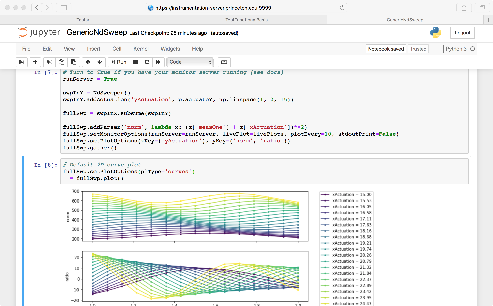

Welcome to Lightlab's documentation!
================================================

    This package offers the ability to control multi-instrument experiments, and to collect and store data and methods very efficiently. It was developed by researchers in an integrated photonics lab (hence lightlab) with equipment mostly controlled by the GPIB protocol. It can be used as a combination of these three tasks:

    #. Consolidated multi-instrument remote control
    #. Virtual laboratory environments: repeatable, shareable
    #. Utilities for experimental research: from serial comm. to testing, analysis, gathering, post-processing – to paper-ready plotting
    #. All structured in python

    ``lightlab`` in a Jupyter notebook

We wrote this documentation with love to all young experimental researchers that are not necessarily familiar with all the software tools introduced here. We attempted to include how-tos at every step to make sure everyone can get through the initial steps.

.. warning::

    This is not a pure software package. Lightlab needs to be run in a particular configuration. Before you continue, carefully read the :ref:`pre-requisites` and the :ref:`getting-started` sections. It contains necessary information about setup steps you need to take care before starting.

.. _pre-requisites:

Pre-requisites
--------------

    If you intend to perform any kind of experiment automation, please read this section carefully. However, to load and visualize data, or to run a virtual experiment, the following is not needed.

Hardware
^^^^^^^^

    In order to enjoy lightlab's experiment control capabilities, we assume that you have VISA compatible hardware: at least one computer with a GPIB card or USB-GPIB converter; one instrument; and your favorite VISA driver installed. Just kidding, there is a one-company monopoly on that (see :ref:`pyvisa-reference`).

.. _pyvisa-reference:

pyvisa
^^^^^^

    We rely heavily on pyvisa_ for instrument control. It provides a wrapper layer for a VISA backend that you have to install in your computer prior to using lightlab. This is typically going to be a *National Instruments* backend, but the pyvisa team is working on a new pure-python backend (pyvisa-py_). Refer to pyvisa_installation_ for installation instructions.

    Currently we are also working with *python3*. This might present some minor inconvenience in installation, but it allows us to write code that will be supported in the long term. All dependencies are easily available in python3.

    Proceed with enjoying lightlab once you have the following output::

        >>> import visa
        >>> rm = visa.ResourceManager()
        >>> print(rm.list_resources())
        ('GPIB0::20::INSTR', 'GPIB1::24::INSTR', 'ASRL1::INSTR', 'ASRL2::INSTR', 'ASRL3::INSTR', 'ASRL4::INSTR')

    .. _pyvisa: https://github.com/pyvisa/pyvisa
    .. _pyvisa_installation: http://pyvisa.readthedocs.io/en/stable/getting.html
    .. _pyvisa-py: https://github.com/pyvisa/pyvisa-py

Installation
------------

You can install the lightlab package like any other python package::

    pip install lightlab

If you are new to python programming, jupyter notebooks, you might want to sit down and patiently read the :ref:`getting-started` Pages. If you want to develop and write drivers, good for you. It's on `github <https://github.com/lightwave-lab/lightlab>`__ along with guides on contributing and can be cloned by::

    git clone git@github.com:lightwave-lab/lightlab.git

Your environment will be slightly different if you're developing, described :ref:`here <basic_environment>`.

.. toctree::
   :maxdepth: 2
   :caption: Contents:

   _static/gettingStarted/index
   _static/developers/index
   _static/tutorials/index
   _static/misc/index

API
---

.. toctree::
   :maxdepth: 1

   API of the lightlab package <API/lightlab>
   Unit tests <TestAPI/tests>

.. note::

    This documentation contains ipython notebooks. It is possible to open them with a jupyter kernel and run them interactively to play with knobs and see more plotting features.

* :ref:`genindex`
* :ref:`modindex`
* :ref:`search`
